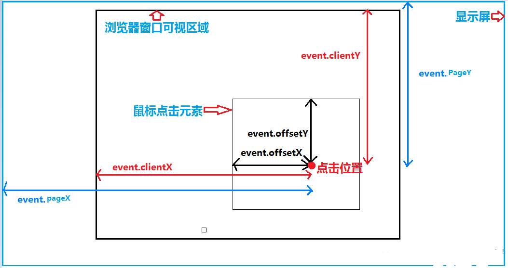

## Js相关知识点，
### 关于this：
* ☞ 拥有不同的值，具体取决于它的使用位置
    ```  
    1. 方法中的this, 指调用方法的对象:
        var person = {
            firstName: "Bill",
            lastName : "Gates",
            id     : 678,
            fullName : function() {
                return this.firstName + " " + this.lastName + alert(this);  ==> [object Object]
            }
        };
        document.getElementById("demo").innerHTML = person.fullName();
    
    2. 单独的this, 指全局对象[object Window]:
        var x = this;   ==>[object Window]
        document.getElementById("demo").innerHTML = x;

    3. 函数中的this, 指全局对象[object Window]
       JS中函数的拥有者默认绑定 this, 严格模式(undefined)
        document.getElementById("demo").innerHTML = myFunction();
        function myFunction() {
            return this;    ==>[object Window]
        }

    4. 事件处理中的this, 指接收此事件的 HTML 元素
        <button onclick="this.style.display='none'; alert(this)">单击来删除我！</button>  ==>[object HTMLButtonElement]
    ```
+ 以函数的形式调用时, this永远都是window。比如fun();相当于window.fun();
+ 以方法的形式调用时, this是调用方法的那个对象
+ 以构造函数的形式调用时, this是新创建的那个对象
+ call() 和 apply() 方法可以将 this 引用到任何对象

### js调用函数时加括号与不加括号的区别
+ 函数名其实就是指向函数体的指针 
+ 不加括号，可以认为是查看该函数的完整信息， 
+ 不加括号传参，相当于传入函数整体 
+ 加括号 表示`立即调用（执行）这个函数里面的代码`（花括号部分的代码）
+ toCelsius 引用的是`函数对象`，而 toCelsius() 引用的是`函数结果`

### 关于函数返回值：
* ☞ 函数名+括号: fn1() ==> return 后面的的值，函数返回值
* ☞ 仅仅 是函数名调用：fn1 ==>函数体对象为参数，即整个函数代码
* ☞ 所有函数默认返回值：未定义
* ☞ return 之后任何代码都不执行

### 关于定时器：
* ☞ var timer = setInterval(函数名, 毫秒);
  - clearInterval(timer);	// 重复执行
  - clearTimout(timer);	// 执行一次

### 关于OOP：
* 特点：
  - ☞ 抽象：抓问题核心
  - ☞ 封装：不考虑内部实现原理，只考虑功能使用
  - ☞ 继承：从已有对象，继承出新的对象，多重继承，多态
* 组成：
  - ☞ 方法：函数(过程、动态的)
  - ☞ 属性：变量(状态、静态的)
    ```          
    function People (name) {  // 构造
        this.name = name;	//  属性
        this.showName = showName;
    }							
    function showName () {	// 方法
        alert(this.name);
    }
    var p1 = new People('Jhon');
    p1.showName();
    =========================================
    function People (name) {
        this.name = name;
    }							
    People.prototype.showName = function () {
        alert(this.name);
    }
    var p1 = new People('Jhon');
    p1.showName();
    ```

### 关于 DOM 对像.属性 操作的各种尺寸宽高：  
* ☞ **offset**
  - `offsetWidth[Height]`   --> 元素(盒子)的 [宽高+padding+border]() 
  - `offsetLeft[Top]`   --> 元素(盒子)的[父级带有定位属性，左侧(顶部)距离数字]()，**从父亲的 padding 开始算，父亲的 border 不算**；若没有定位，则以body为准  

* ☞ **offsetParent**
  - 带有定位的父级元素节点，若[没有定位，返回结果为body]()；若有[返回最近的父级元素]()  
  - 本身定位为`fixed`
    * offsetParent:null (非火狐)
	* offsetParent:body（火狐）
  - 本身定位不为`fixed`
    * 父级没有定位：offsetParent:body
	* 父级有定位：offsetParent:定位父级

* ☞ **scroll**  
  - `scrollWidth[Height]` --> 元素(盒子)的宽高，[不包括border+margin]()，`scrollWidth[Height]=width[Height]+padding`  
    > scrollHeight有一个特点：如果文字超出了盒子，高度为内容的高（包括超出的内容）；不超出，则是盒子本身高度。
  - `scrollTop[Left]` --> 网页被卷去的头部与左部的距离，[兼容写法：]() `window.pageYOffset || document.body.scrollTop || document.documentElement.scrollTop`

* ☞ **client**  
  - `clientWidth[Height]`   --> 元素(盒子)的宽高，[padding + width[height]]()，调用body / html 为获取网页可视区的宽高
  - `clientX[]Y]`   --> 鼠标距离可视区[左侧  /   上侧的距离]()
  - `clientTop[Left]`   --> 元素(盒子)的[上   /   左border]()

* ☞ 总结：  
  - 区别1：宽高
    ```    
    offsetWidth = width + padding + border  //  占位宽
    offsetHeight = height + padding + border     //  占位高

    scrollWidth = 内容宽度（不包含border） //  内容宽
    scrollHeight = 内容高度（不包含border） // 内容高

    clientWidth = width + padding   //  可视区宽
    clientHeight = height + padding //  可视区高
    ```
    
  - 区别2：上左  
    ```
    offsetTop/offsetLeft：
    调用者：任意元素。(盒子为主)
    作用：距离父系盒子中带有定位的距离。

    scrollTop/scrollLeft：
    调用者：document.body.scrollTop（window调用）(盒子也可以调用，但必须有滚动条)
    作用：浏览器无法显示的部分（被卷去的部分）。

    clientY/clientX：
    调用者：event   // 重要
    作用：鼠标距离浏览器可视区域的距离（左、上）
    ```
*   

### 获取元素的样式：
* currentStyle -->该属性获取当前元素的样式，只有IE支持
  - box1.currentStyle.width
* getComputerStyle() -->该方法获取当前元素样式，
  - getComputerStyle((box1, null).width);
* [参看 {}、[]、()区别](https://blog.csdn.net/qq_20069429/article/details/83267887)
* `{}` -->表示对象;`[]`-->表示对象的属性、方法;`()`-->如果用在方法名后面

```
function getStyle(obj, attr) {
    return obj.currentStyle?obj.currentStyle[attr]:obj.getComputerStyle[attr];
}
showMsg.innerHTML = "x = "+x + ", y = "+y; // x, 均为变量
```
### 关于闭包：
* 嵌套的内部函数引用了嵌套的外部函数的变量，就产生了闭包
* 闭包 存在于嵌套的内部函数中
```
-------------------------------------
function foo() {
    var a = 2;
    function bar() {
        alert(a);
    }
    return bar;
}
var baz = foo();
baz();  // 2
------------------------------------
<h1>JavaScript 闭包</h1>
<p>使用局部变量计数。</p>
<button type="button" onclick="myFunction()">计数！</button>
<p id="demo">0</p>

<script>
var add = function() {
  var counter = 0;
  return function() {
      counter += 1; 
      return counter;
    }
}();

function myFunction(){
  document.getElementById("demo").innerHTML = add();
}
</script>
```

### 关于ES6
### 变量的解构赋值, 给多个形参赋值
```
对象的解构赋值: 
let obj = {username: 'anyue', age: 39};
// let username = obj.username;
let {username, age} = obj;

数组的解构赋值:
let arr = [1, 3, 5, 'abc', true];
let [, , c, d, e] =arr;

function foo({username, age}) {
    console.log(username, age);
}
```

### 模版字符串
**必须用 `` 包含**  
**变化的部分使用 {xxx} 定义**
```
let obj = {username: 'anyue', age: 39};
let str = '我的名字是: ' + obj.username + ', 我今年的年龄是: ' + obj.age;
str = `我的名字是: $(obj.username), 我今年的年龄是: {obj.age}`;

```

### 对象的简写方式
```
let username = 'anyue';
let age = 39;
let obj = {
    // username: username,
    // age: age,
    // getName: function(){}

    username,   // 省略同名的属性值
    age,
    getName() { // 省略方法的 function
        return this.username;
    }
};
```

### 箭头函数
不是调用的时候决定的, 而是在定义的时候处在的对像就是 它的this, 常规函数则相反
箭头函数的`this`确定: 外层有函数, 则外层函数的this就是内部箭头函数的this, 若没有, 则this是window
参数 => 语句/表达式
```
// let fun = function() {};
let fun = () => console('我是箭头函数');
fun();
形参:
  1.没有形参:
    let fun1 = () => console.log('我是箭头函数');
    fun1;
  2.只有一个形参:
    let fun2 = a => console.log(a); // 形参的()可以省略
    fun2(aaa);
  3.两个及以上:
    let fun3 = (x, y) => console.log(x, y); 
    fun3(25, 36);
函数体:
  1.函数体只有一条执行语句/表达式, {}可以省略, 会自动返回执行的结果:
    let fun4 = (x, y) => x+y; // let fun1 = (x, y) => {return x+y};
    console.log(fun4(25, 36));
  2.函数体不只一条执行语句/表达式:
    let fun5 = (x, y) => {
        console.log(x, y);
        return x + y;
    }
    console.log(fun5(25, 36));
测试箭头函数的this:
let btn1 = doucument.getElementById('btn1');
let btn2 = doucument.getElementById('btn2');

btn1.onclick = function() {alert(this)};    // this = btn1
btn2.onclick = () => {alert(this)}  // this = Window

let obj = {
    name: '箭头函数',
    getName: function(){
        btn2.onclick = () => {alert(this)};
    }
}
obj.getName();  // this = obj
```
### 三点运算符 && 数组扩展方法 
```
function foo(...value){
    console.log(value);
    value.foreach(function(item, index){
        console.log(item, index);
    })
}

var arr = [2, 4, 3, 1, 2, 6, 5, 4];
console.log(arr.indexOf(4));    // 1 得到值在数组中的第一个下标

console.log(arr.lastIndexOf(4));    // 7 

arr.forEach(function(item, index) {
    console.log(item, index);   // 遍历数组
});

var arr1 = arr.map(function(item, index) {
    return item+10;
});
console.log(arr1, arr);  // 遍历数组返回新的数组, 返回加工之后的值

var arr2 = arr.filter(function(item, index) {
    return item > 3;
})
console.log(arr2, arr); // 4, 6, 5, 4
```

### Promise 对象
```
function getNews(url) {
    let promise = new Promise((resolve, reject) => {
        // 状态: 初始化

        // 执行异步任务
        let xmlHttp = new XMLHttpRequest();
        xmlHttp.onreadystatechange = function() {
            if(xmlHttp.readyState ===4){
                if(xmlHttp.status == 200){
                    console.log(xmlHttp.reponseText);
                    resolve(xmlHttp.reponseText);  // 修改
            }else{
                reject('暂时没有数据');
                }
            }
        };
        xmlHttp.open('GET', url);
        xmlHttp.send();
    })
    return promise;
}
getNews('http://localhost:1080/news?id=2')
    .then((data) => {
        console.log(data);
        let commentsUrl = JSON.parse(data).commentsUrl;
        let url = 'http://localhost:1080' + commentsUrl;
        return getNews(url);
    }, (error) =>{
        console.log(error);
    })
```


